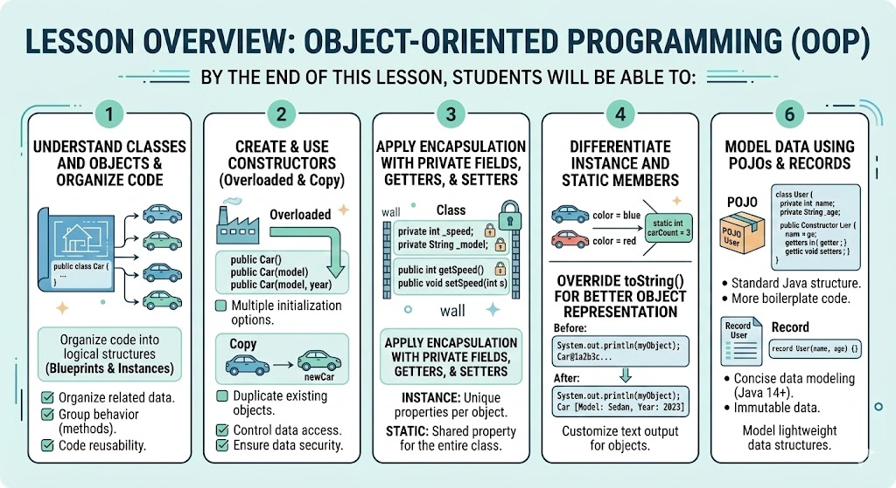

# [3.6] Introduction to Object-Oriented Programming (OOP)

## Lesson Overview

## Dependencies
- [Self Studies](./studies.md)
- [Lesson](./lesson.md)
- [Assignment](./assignment.md)
- [Slide Deck](./slides.md)

## Lesson Objectives
* **Create** classes with attributes, constructors, and methods
* **Apply** encapsulation using private fields, getters, and setters
* **Differentiate** between instance and static members
* **Override** `toString()` for meaningful object representation
* **Model** data using POJOs and Records

## Lesson Plan

| Duration | What | How or Why |
|----------|------|------------|
| 10 min | Warm up | Recap Lesson 3.5 — review classes concept and why we need them |
| 15 min | Part 1: Class Attributes and Methods | Code-along with Person class; compare variables vs grouped attributes |
| 25 min | Part 2: Constructors | Parameterized, overloaded, and copy constructors; code-along |
| 10 min | Activity 1 — Car constructors | Students create Car class with 3 constructors |
| 20 min | Part 3: Encapsulation, Getters & Setters | Private fields, accessor and mutator methods; code-along |
| 15 min | Part 4: Static keyword | Static attributes and methods; personCount example |
| 10 min | Part 5: toString & @Override | Overriding toString for object printing |
| 10 min | Activity 2 — Car encapsulation + static + toString | Students extend Car class |
| 10 min | Break | — |
| 10 min | Part 6: Intro to POJO | Expense example with ArrayList |
| 20 min | Part 7: Intro to Record + VendingMachine activity | Record syntax; students build VendingMachine class |
| 15 min | Wrap up | Recap OOP pillars, preview assignment, Q&A |
| **Total** | | **170 min — allows ~10 min buffer** |